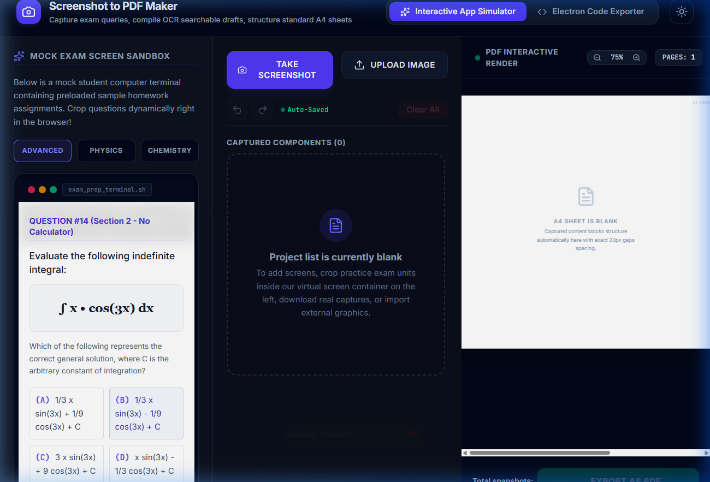

# 📸 SnapPDF Studio - Standalone Desktop App (Windows)

SnapPDF Studio is a lightweight desktop application designed to capture screen selections, run local OCR text extraction, and compile them into standardized, search-indexed A4 PDF documents.

This version is built using **Electron**, **jsPDF**, and **Tesseract.js** to run locally as a native Windows utility.

---

## 🖥️ Application Interface Preview



---

## 🌟 Key Features

*   **Native Area Capture:** Press `Ctrl + Shift + S` or click **Take Screenshot** to dim the screen and select any rectangular area on your desktop.
*   **File Upload Support:** Drag-and-drop or select images (`.png`, `.jpg`, `.jpeg`, `.webp`) directly into the sidebar dashboard.
*   **Toggleable OCR Scanning (Per-Image & Global):** 
    *   **Global Switch:** Toggle OCR scanning globally for all active images and newly added screen clips using the top **OCR** toggle switch.
    *   **Individual Switch:** Fine-tune OCR scanning/embedding for specific screenshots using the iOS-style toggle switch on each card.
*   **Real-time Image Scaling:** Adjust each screenshot's size from 10% to 100% using a sliding range control. The A4 preview page immediately reflects the scaling in real-time.
*   **A4 Live Render & Margin Wrapping:** A WYSIWYG preview panel detailing page limits, zoom scaling (30% to 150%), and red dashed horizontal lines representing native A4 pagination breaks.
*   **Automatic PDF Storage:**
    *   Saves all exported PDFs directly to your Windows `Documents/PDF Screenshot Collector` folder automatically.
    *   Prompts you with a custom naming dialog before saving so you can choose the file name.
    *   Automatically highlights the saved file inside Windows Explorer upon completion.
    *   Click the **Open PDF Folder** button to open the folder directly in Explorer.
*   **Clean Framing:** Hides the default Electron menu bar (File, Edit, View, etc.) to optimize workspace height.
*   **Sequencing and Orientation:** Rotate cards 90° clockwise, drag-and-drop cards to swap their positions, rename labels, and edit OCR text metadata manually before rendering.

---

## 📂 Codebase Structure

```
snappdf-studio/
├── assets/
│   └── screenshot.png  # Application screenshot asset
├── package.json        # Main desktop build configurations and scripts
├── main.js             # Electron main process (window lifecycles, global captures, IPC)
├── preload.js          # Secure ContextBridge API for Electron renderer interaction
├── renderer/           # Main UI interface
│   ├── index.html      # UI page template
│   ├── script.js       # App controller (undo/redo, lists, OCR, canvas renderer)
│   └── style.css       # Core styles (scrollbars and themes)
└── utils/
    └── pdfManager.js   # PDF compiling module (jsPDF config)
```

---

## 🚀 Running the Desktop App

### 1. Prerequisites
Install [Node.js](https://nodejs.org/) (version 18 or above).

### 2. Install Dependencies
Run the clean package install:
```bash
npm install
```

### 3. Run the App
Launch the desktop application window:
```bash
npm start
```

### 4. Build Windows Executable (`.exe`)
To package the app into a portable Windows executable installer inside a `dist/` folder:
```bash
npm run build:win
```
or
```bash
npm run package
```
